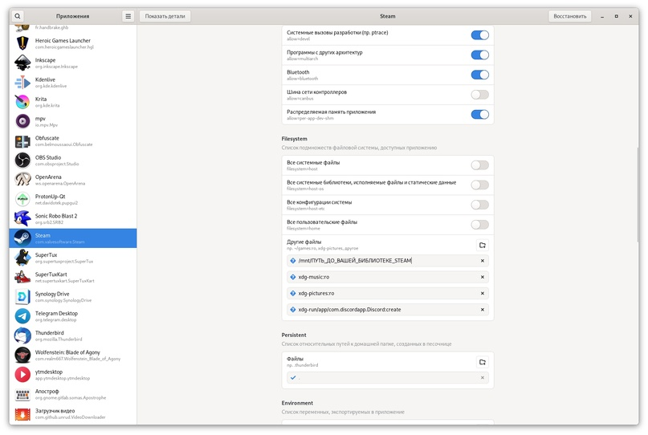

# FEDORA36 STARTING UP

> Привет, перед началом этого гайда хотел бы сказать, что я делал его под себя и вам он может не подходить. Не стоит следовать каждому пункту и устанавливать то софт который вам не нужен.

| [Источник](https://vk.com/@plafonvk-fedorazero) | [Разметка дисков](https://vk.com/video-211011902_456239066) |

## Создание загрузочной флешки

1. Установливаем [Ventoy](https://github.com/ventoy/Ventoy/releases) или Fedora Media Writer. На крайняк [Rufus](https://rufus.ie/)
2. Запустите Ventoy и [создайте мультизагрузочную флешку](https://youtu.be/88RS7H0p8kQ) или загрузите образ через другие программы.
3. Скачайте [Fedora](https://getfedora.org/ru/workstation/download/) или [Nobara](https://nobaraproject.org/) (многое пофикшено, но я свовил достаточно багов чтобы отказаться от этого решения. Добавлю также, что некоторые пункты из этого гайда выполнять на Nobara не нужно! К примеру `nvidia.sh` и `games.sh`)

## Батарея
Заходим в настройки батареи и выключаем всё что вас должно тревожить

## Игры
Запустите `sh games.sh`, после запустите steam и залогиньтесь. Дальше зайдите в ProtonUP-Qt и скачайте последнюю версию proton-ge (Дальше она появиться в compatibility в свойствах игры в стиме. Вы должны будете выбрать её). Также вы сможете запускать пиратские игры через lutris.

- Если вы изменили местоположение библиотеки стим, чтобы он запускал игры добавьте путь до неё в flatseal. Для примера `~/games` или `/mnt/disk1/games` 

