```curl -sS https://github.com/hoopengo/fedora-dots/main/install.sh | sh```

<details>
<summary><b>Full installation</b></summary>

> Before you start reading this guide, I would like to say that I made it for myself (programmer) and it may not suit you. Do not follow every point and install the software that you do not need!

## Creating a bootable flash drive

1. Install [Ventoy](https://github.com/ventoy/Ventoy/releases) or Fedora Media Writer. To the extreme [Rufus](https://rufus.ie/)
2. Run Ventoy and [create multiboot flash](https://youtu.be/88RS7H0p8kQ) or download the image via other programs.
3. Download [Fedora](https://getfedora.org/ru/workstation/download/) or [Nobara](https://nobaraproject.org/) (much fixed, but I caught enough bugs to abandon this solution .)

## Installation

If there is an item `Network and host name`, and it lights up with an error, then select your wifi adapter there and connect to the network.

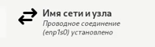

If there's an item `Install Source`, choose the nearest mirror and click done

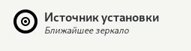

If you have the item `Select programs`, then choose Fedora Workstation there and click done.

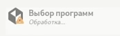

This is where you create a root user and create your own user. Or you can give root rights to your user, to do that skip the item `Root account` and make sure you check the option `Give root rights` under the item `Create user

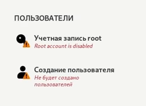

## Disk Partitioning

[Видео](https://vk.com/video-211011902_456239066)

I decided to put this in a separate item because it's the most important thing.

1. First, choose the disks you want to use.

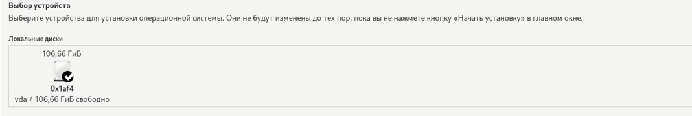

2. Then in partitioning method choose `Blivet-GUI


3. Delete all partitions from disks.
4. Create an `efi` partition. In the file system, select `Efi partition manager`

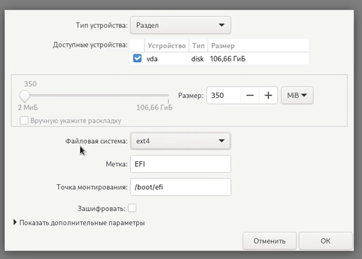

5. Create a `boot` partition

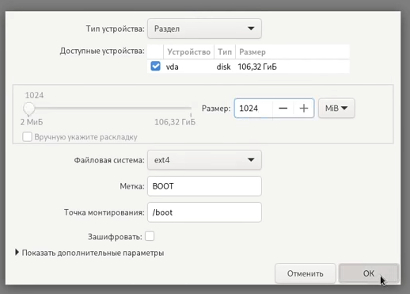

6. Create a `swap` for 8 GB (if you don't mind) or 5 GB (if you don't mind). I use 16GB btw.

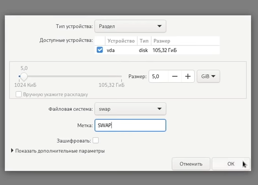

7. For the rest of the space, mark up btrfs without a mount point

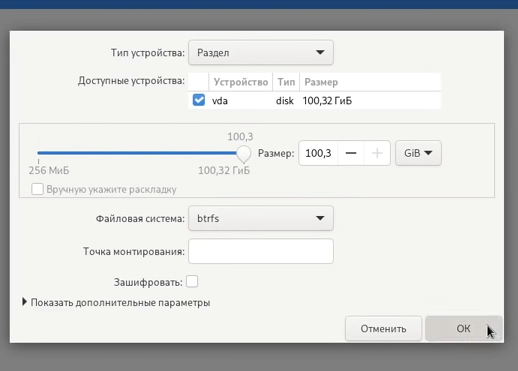

8. Create sub-values ​​in the correct sequence

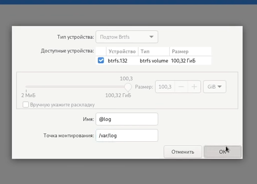

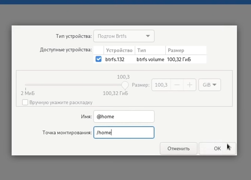

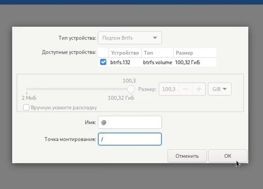

9. We check their correctness.

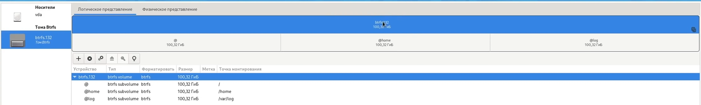

10. If there are more disks, mark them with `ext4` and write `/mnt/{your_name}` at the mount point, for example I have `/mnt/TOSHIBA_1TB`

# Customization

```curl -sS https://github.com/hoopengo/fedora-dots/main/install.sh | sh```

1. Go to gnome-tweaks and set theme as [catppuccin-mocha](https://github.com/catppuccin/gtk/releases/).
2. In Gnome Terminal, open Menu -> Profiles, and enable the profile for the theme you want.
3. Set MPV as default video and audio player.

## Setting up the `fstab`

Here you need to be more careful. <b>Only do this if you have an ssd!</b>

First, make a copy of your fstab just in case. `cp /etc/fstab ~/fstab-copy`.

Next open fstab: `sudo nano /etc/fstab` and put a line in our `,defaults,noatime,discard=async` and save the file and do `sudo reboot`

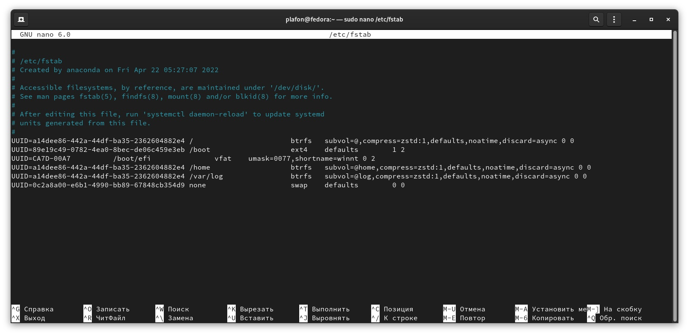

If the system does not start or enters "safe mode", then:

1. Shut down the computer.
2. Hold down SHIFT when starting up.
3. Select fedora from the list and press `e`.
4. At the end write `single init=/bin/bash`.
5. Also replace `ro` with `rw`.
6. You may not have console commands working, so write `sudo su`, `/usr/bin/nano ~/fstab-copy`, copy all the contents. `/usr/bin/nano /etc/fstab`, replace the contents with what you copied.
7. Save the file and write `sudo reboot -f -f `.
8. The system will restart and should now be up and running.

</details>


