# FEDORA36 STARTING UP

> Перед началом этого гайда хотел бы сказать, что я делал его под себя (python программиста) и вам он может не подходить. Не стоит следовать каждому пункту и устанавливать тот софт который вам не нужен. Зайдите в папку scripts и отредактируйте скрипты под себя. Спасибо!

**Источники:**
<details>

<!-- start -->
 1. [Fedora Linux 36 | ДЕТАЛЬНАЯ НАСТРОЙКА С НУЛЯ (2022) | Fedora Zero](https://vk.com/@plafonvk-fedorazero)
 2. [Fedora Zero](https://vk.com/@plafonvk-fedorazero)
 3. [Линукс софт на каждый день](https://youtu.be/SDhg_UF0NCI)
 4. [КАК НАЧАТЬ ИГРАТЬ НА ЛИНУКСЕ](https://youtu.be/Y53Ox2tmsLU)
 5. [DaVinci Resolve 17 на Fedora Linux 35](https://youtu.be/39_wWFBcP2E)
 6. [gamer station [on linux]](https://www.youtube.com/c/UbuntariumbyRedroot)
 7. [LINUX GAMING для новичков](https://youtu.be/BlbPb3QVjR8)
 8. [nstalling & Customizing The Fish Shell](https://youtu.be/wpinXVpL5-U)
 9. [My Fish shell workflow for coding](https://youtu.be/KKxhf50FIPI)
 10. [Creating Functions In The Fish Shell](https://youtu.be/ec1A3YGQY60)
<!-- end -->
  
</details>

## Создание загрузочной флешки

1. Установливаем [Ventoy](https://github.com/ventoy/Ventoy/releases) или Fedora Media Writer. На крайняк [Rufus](https://rufus.ie/)
2. Запустите Ventoy и [создайте мультизагрузочную флешку](https://youtu.be/88RS7H0p8kQ) или загрузите образ через другие программы.
3. Скачайте [Fedora](https://getfedora.org/ru/workstation/download/) или [Nobara](https://nobaraproject.org/) (многое пофикшено, но я свовил достаточно багов чтобы отказаться от этого решения.)

## Установка Fedora36

Если у вас есть пункт `Выбор программ`, тогда выбираем там Fedora Workstation и нажимаем готово. 

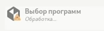

Если есть пункт `Имя сети и узла`, и он горит ошибкой, то выбираем там ваш wifi-адаптер и подключаемся к сети.

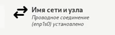

Тут создаем root пользователя и своего личного. Ну или же можно дать root права вашему пользователю, для этого пропустите пункт `Учётная запись root` и убедитесь что стоит галочка на Выдать wheel права в пункте `Создание пользователя`

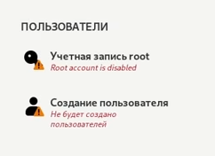

Если есть пункт `Источник установки`, выбираем ближайшее зеркало и нажимаем готово

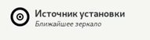

## Разметка диска
[Видео](https://vk.com/video-211011902_456239066)

Я решил вынести это в отдельный пункт, потому-что это самое важно.
1. Для начала выбираем те диски, которые вы хотите использовать.

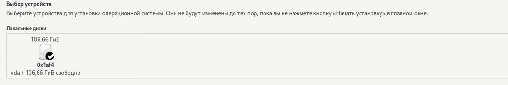

2. Потом в способе разметки выбираем `Blivet-GUI`

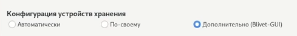

3. Удаляем все разделы с дисков.
4. Создаём `efi` раздел. В файловой системе выбираем `Efi partition manager`

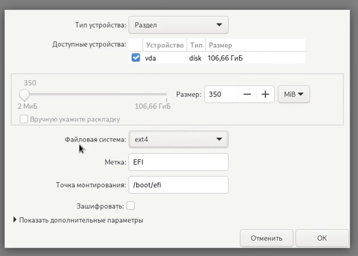

5. Создаём `boot` раздел

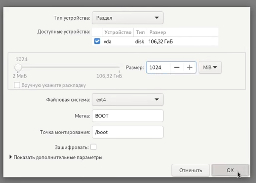

6. Создаём `swap` на 8 гб (если не жалко) или на 5 гб (если жалко)

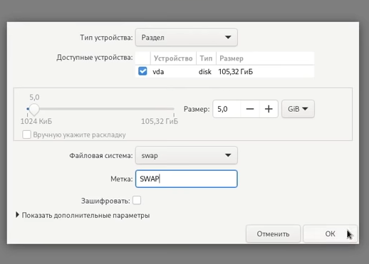

7. Для остального пространства размечаем btrfs без точки монтирования

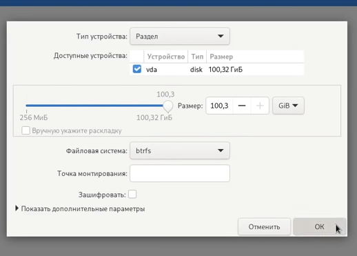

8. Создаём субвалюмы в правильной последовательность

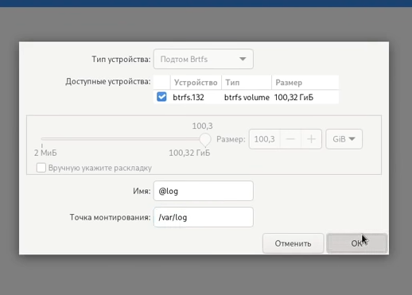

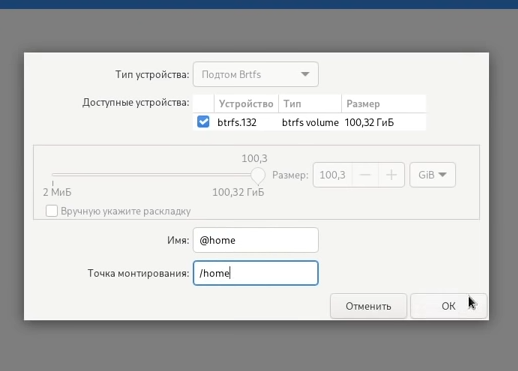

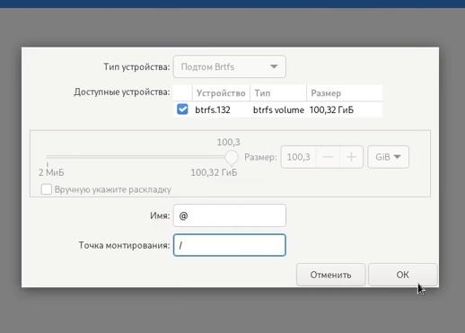

9. Проверяем их правильность.

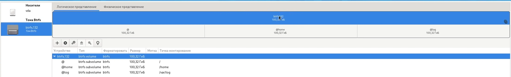

10. Если есть ещё диски, размечаем их `ext4` и в точке монтирования пишем `/mnt/{ваше_имя}`, для примера у меня стоит `/mnt/disk1`

## Настройка `fstab`
Тут нужно быть осторожнее. Делайте только если у вас ssd!
Для начала делаем копию нашего fstab на всякий случай. `cp /etc/fstab ~/fstab-copy`
Дальше нужно вставить строчку в наши субвалюмы `,defaults,noatime,discard=async`, после чего сохранить файл и прописать sudo reboot.

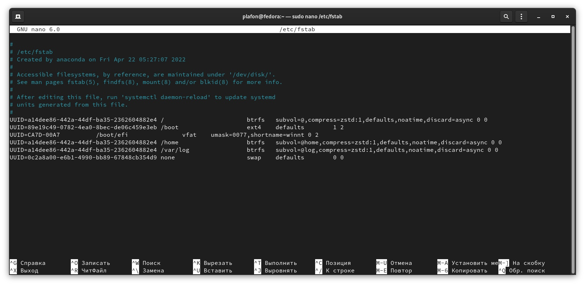

Если система не запускается или входит в "безопасный режим", то:
1. Выключаем компьютер
2. При запуске зажимаем SHIFT
3. Выбираем fedora из списка и нажимаем `e`
4. В конце дописываем `single init=/bin/bash`
5. Также заменяем `ro` на `rw`
6. У вас могут не работать консольные команды, поэтому пишем `sudo su`, `/usr/bin/nano ~/fstab-copy`, копируем всё содержимое. `/usr/bin/nano /etc/fstab`, заменяем содержимое на то что скопировали.
7. Сохраняем файл и пишем `sudo reboot -f -f`
8. Система перезапуститься и должна начать работать.

## Первичная настройка
Заходим в Установщик программ, он будет закреплён на вашем доке, и включаем сторонние репозитории.

Ускоряем dnf:
`sudo nano /etc/dnf/dnf.conf`

- Добавляем это:
```
skip_if_unavailable=True
fastestmirror=True
max_parallel_downloads=10
defaultyes=True
```

- Дальше выполняем поочерёдно этот кусок:
```
sudo dnf autoremove
sudo dnf clean all
sudo dnf update
sudo reboot
```

Копируем этот репозиторий `git clone https://github.com/hoopengo/fedora-startup.git` и устанавливаем python `sudo dnf install python`, проверяем версию `python -V`, должна быть **3.10^**.

Запускаем скрипт `python setup.py` и начинаем начальную установку, вы сами можете зайти в файл (`scripts/setup.sh`) и отредактировать его, удалив или добавив что-то. После установки, вам будет предложено перезагрузить систему и дабы не возникало ошибок, лучше это сделать.

После перезапуска снова запускаем скрипт и отказываемся от первичной установки. 

## Дальше идут фиксы:
1. Фикс звука - убирает назойливый bell. Убирает ограничение в 100% макс.звука и устанавливает шаг громкости *2*
2. Фикс смены раскладки - заменяем super+space на alt+shift (что сделать вручную почему-то нельзя). Также лучше зайти в gnome-tweaks и выключить там смену раскладки по alt+shift
3. Фикс скролла мыши - увеличит скролл мыши до 2, это можно изменить в `scripts/scroll-fix.sh`

Также зайдём в Настройки > Клавиатура и добавим комбинацию клавиш для терминала (Ctr+Alt+T)

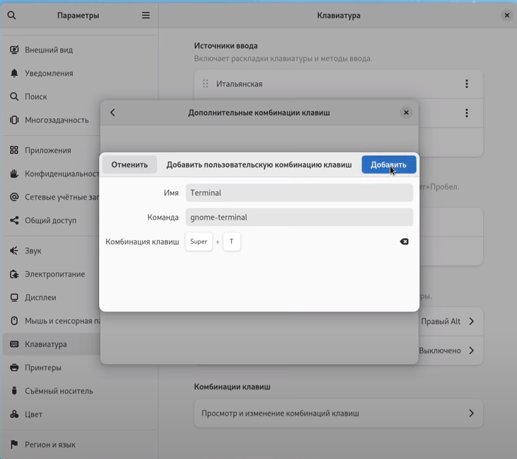

## Nvidia
После вам предложат установить nvidia драйвера. Если у вас не nvidia, то пропустите этот пункт, после установки система сразу перезапустится. Дальше при вводе пароля жмём на шестерёнку и выбираем gnome с xorg, чтобы система работала коректно. Всё готово.

Также отмечу, что лучше установить вторую систему, к примеру на fedora xfce или windows именно для игр, где и установить проприетарные nvidia дрова. Я делаю именно так, потому-что у меня старая видюха, а если нужно поиграть или же монтировать видео, то переключаюсь на винду.

## Игры
Установка игровых штук. Среди которых:
1. steam
2. PortProton
3. protonUP-QT

Запустите steam и залогиньтесь. Дальше зайдите в ProtonUP-Qt и скачайте последнюю версию proton-ge (Дальше она появиться в compatibility в свойствах игры в стиме. Вы должны будете выбрать её). Также вы сможете запускать пиратские игры через lutris. И запускать другие лаунчеры через PortProton

Отмечу также сайт [protondb](https://protondb.com), на нём можно узнать разные баги и что к ним приводит, а также параметры запуска.

## Софт
Самое долгое. Установка ВСЕГО софта.

Flatpak:
1. ExtensionManager
2. VideoDownloader
3. OBS
4. Fragments
5. Collision
6. handbrake
7. MetadataCleaner
8. GPUViewer
9. mpv
10. dejadup (Backups)
11. krita
12. telegram
13. onlyoffice
14. discord
15. chrome

Snap:
1. vscode
2. pycharm community.ed

## Устанавливаем "плагины"
Заходим в менеджер расширений gnome (Extension Manager), если нету, то скачайте:

`flatpak install flathub com.mattjakeman.ExtensionManager`

Расширения:
1. [AppIndicator and KStatusNotifierItem Support](https://extensions.gnome.org/extension/615/appindicator-support/)
2. [Sound Input & Output Device Chooser](https://extensions.gnome.org/extension/906/sound-output-device-chooser/)
3. [Vitals](https://extensions.gnome.org/extension/1460/vitals/)
4. [Status area Horizontal Spacing](https://extensions.gnome.org/extension/355/status-area-horizontal-spacing/)
5. [ArcMenu](https://extensions.gnome.org/extension/3628/arcmenu/) (Тут на выбор, это удобная вещь, но не для всех)

Заходим в настройки arcmenu, Position выбираем right, включаем Show Activities Button. Также можете назначить свой hotkey и изменить много всего, тут уже на ваше усмотрение.

## Настройки в gnome-tweaks
Во вкладке Apperance(2) выбираем тему Adwaita-dark(5)

Во вкладке Top Bar(6) в Clock выбираем все пункты (это позволит нам видить дату и секунды)

Во вкладке Window Titlebars(7). Тыкаем на Maximize(4) и Minimize(5)

Заходим в обычные настройки во вкладку Multitasking и выключаем Hot Corner (это первый пункт). Лично я оставляю этот пункт, но иногда он бесит.

## Батарея
Заходим в настройки батареи и выключаем всё что вас должно тревожить

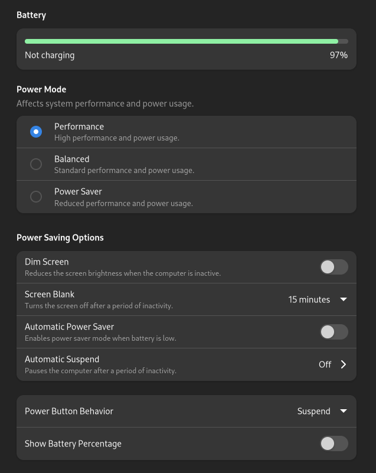
